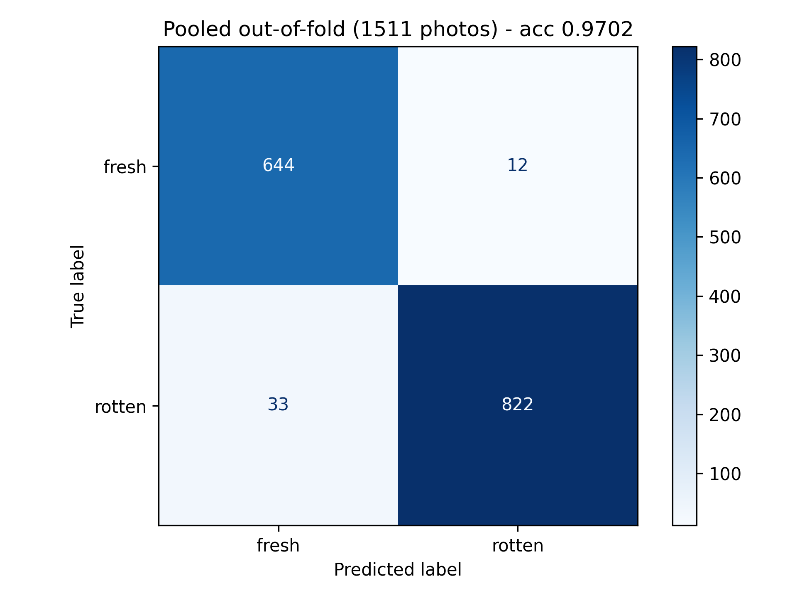
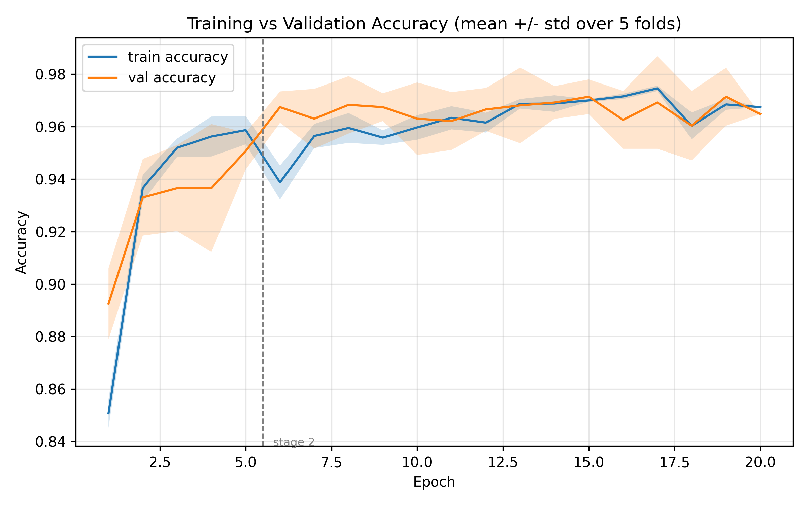

# fruit-freshness-cnn

Classify a photo of fruit as **fresh** or **rotten**, using an EfficientNet-B0 CNN fine-tuned in PyTorch. EfficientNet is a highly optimized convolutional neural network (CNN) designed for environments with limited computational resources. Here, three fruits are covered: Apples, Bananas and Oranges.


## Contents

- [Quick start](#quick-start)
- [Results](#results)
- [Dataset](#dataset)
- [How it works](#how-it-works)
- [Project structure](#project-structure)
- [Limitations](#limitations)

## Quick start

Install:

```bash
git clone https://github.com/Priti0427/fruit-freshness-cnn.git
cd fruit-freshness-cnn
pip install -r requirements.txt
```

Classify any photo. No dataset is needed, takes about 10 seconds:

```bash
python predict.py photo.jpg
```

```
best_fold0.pth on cpu, 2 image(s)

apple_01.png   fresh     96.3%  (fresh 96.3 / rotten 3.7)
banana_02.png  rotten    99.3%  (fresh 0.7 / rotten 99.3)
```

`predict.py` also accepts several files or a whole folder:

```bash
python predict.py a.jpg b.png
python predict.py some_folder/
```

Options:

- Defaults to `checkpoints/best_fold0.pth`. Use `--checkpoint` to pick another fold.
- Preprocessing matches the validation path in `fruit.py`, so results are consistent with the reported metrics.

### Retraining(Optional)

Size of the dataset: 3.8 GB and takes 20 to 25 minutes to train.

1. Download the dataset (see [Dataset](#dataset)) and place it under `data/`.
2. Run:

   ```bash
   python fruit.py
   ```

This runs the full 5-fold cross-validation and writes to `results/`:

- `metrics.json`
- `confusion_matrix.png`
- `accuracy_curve.png`
- `loss_curve.png`

Model weights go to `checkpoints/`, one per fold. The device is picked automatically: Apple GPU (MPS), then NVIDIA (CUDA), then CPU.

## Results

Evaluated with 5-fold cross-validation over 1,511 source photographs. Every photograph is tested exactly once, by a model that never saw it during training.

| Metric | Value |
|---|---|
| **Accuracy** | **97.02%** (95% CI 96.04 to 97.77%) |
| Macro F1 | 0.9698 |
| ROC-AUC | 0.9956 |
| Fold spread | 0.76 pp std across 5 folds |

Compared against three reference points:

| Reference | Score | What it tells us |
|---|---|---|
| Always guess "rotten" | 56.59% | The floor. Anything near this has learned nothing |
| Colour histogram + logistic regression | 88.48% | A deliberately simple model, colour only |
| **EfficientNet-B0** | **97.02%** | Beats the simple baseline by 8.5 pp |
| Shuffled-label control | 47.52% | Collapses to chance, confirming no data leakage |

Per class results:

| Class | Precision | Recall | F1 | Photographs |
|---|---|---|---|---|
| fresh | 0.9513 | 0.9817 | 0.9662 | 656 |
| rotten | 0.9856 | 0.9614 | 0.9734 | 855 |

Per fruit: bananas 99.05%, apples 96.42%, oranges 95.33%.

<p align="center">
  
  
</p>

Full numbers are in [`results/metrics.json`](results/metrics.json).

## Dataset

Source: [Fruits fresh and rotten for classification](https://www.kaggle.com/datasets/sriramr/fruits-fresh-and-rotten-for-classification) on Kaggle.

Download it, unzip, and arrange the six `fresh*` and `rotten*` folders like this:

```
data/
├── train/
│   ├── freshapples/      freshbanana/      freshoranges/
│   └── rottenapples/     rottenbanana/     rottenoranges/
└── test/
    └── (same six folders)
```

`fruit.py` reads `train/` and `test/` together and re-splits them itself. The reason is below.

### A problem with the supplied split

The folders hold 13,599 image files, but only **1,511 distinct photographs**. Each photograph was saved nine times:

- The original
- Five rotations (15, 30, 45, 60, 75 degrees)
- A vertical flip
- A translation
- A salt-and-pepper noise version

All eight variants are identifiable by their filename prefix.

The supplied `train/` and `test/` folders split those nine copies **at random**. Every test photograph therefore also appeared in training:

| Folder | Test photographs | Also in training |
|---|---|---|
| freshapples | 198 | 198 (100%) |
| rottenapples | 300 | 300 (100%) |
| rottenbanana | 259 | 259 (100%) |
| freshoranges | 175 | 175 (100%) |

Training and testing on rotations of the same photograph measures memorisation, not generalisation, and inflates the reported accuracy. This project discards the supplied split and re-splits by source photograph.

## How it works

### Grouping

- Each file is mapped back to its source photograph by stripping the augmentation prefix from its filename, so all nine copies share one group key.
- Splits are made over the **1,511 groups**, never over individual files. A photograph and all its variants always land on the same side of a split.
- Assertions in the code fail loudly if a group is ever found on both sides.

### Evaluation

- **5-fold cross-validation** over the groups. A single hold-out test set would contain only about 227 images, giving a confidence interval of roughly 3 pp. Pooling predictions across five folds uses all 1,511 photographs and halves that.
- **Validation and test use original photographs only.** Six of the nine variants have black corners, an artifact of rotating a rectangular image, which never occurs in a real photograph.
- **Model selection is on macro F1**, not accuracy, since the classes are imbalanced 656 to 855.

### Training

EfficientNet-B0 pretrained on ImageNet, fine-tuned in two stages:

| Stage | Epochs | Trainable | Learning rate |
|---|---|---|---|
| 1, warm-up | 5 | Classifier head only | 1e-3 |
| 2, fine-tune | up to 25 | Head + last two feature blocks | 1e-5 backbone, 1e-4 head |

Details:

- AdamW with cosine annealing, weight decay 1e-4.
- Class-weighted cross-entropy with 0.05 label smoothing.
- Early stopping on validation macro F1, patience 6.
- BatchNorm layers in the frozen backbone stay in eval mode, so their running statistics do not drift.
- Augmentation at training time: horizontal and vertical flips, rotation up to 75 degrees, colour jitter, affine shift, salt-and-pepper noise. Fill is **white**, not the default black, to match the white-background photographs.

### Checking for leakage

The headline number only means something if the grouping actually worked. To test it, the script retrains with the 1,511 labels randomly shuffled. There is then nothing genuine to learn, so an honest model has to fail.

It scores **47.52%**, below the 56.59% you get by always guessing "rotten".

Had any leakage survived, the model could have memorised the shuffled labels and scored highly. It could not.

## Project structure

```
fruit.py                     Training, evaluation and baselines
predict.py                   Demo: classify a photo with a trained checkpoint
requirements.txt             Dependencies
data/                        Dataset (not committed, see Dataset)
checkpoints/                 Per-fold model weights (not committed)
notebooks/
└── eda.ipynb                Exploratory analysis of the dataset
results/
├── metrics.json             Full results: per fold, per class, per fruit, baselines
├── confusion_matrix.png     Pooled out-of-fold confusion matrix
├── accuracy_curve.png       Accuracy, mean and std across folds
├── loss_curve.png           Loss, mean and std across folds
└── train.log                Raw training output (not committed)
docs/
└── Fruit_Ripeness_Detection.pptx
```

Everything the training run produces goes into `results/`. 

Key settings are at the top of `fruit.py`:

```python
N_FOLDS = 5
TRAIN_VARIANTS = "originals"   # or "all", to train on the 9 pre-generated variants
RUN_PERMUTATION_CONTROL = True
RUN_COLOR_BASELINE = True
```

## Limitations

**These are stock product photographs, not real-world photographs.** Every image is a single piece of fruit, studio-lit against a plain white background. Real photographs have shadows, clutter, varied lighting and several fruits at once. 97% is an honest figure for this dataset and an upper bound for real-world use.

**Errors are asymmetric.** 33 rotten photographs were classified as fresh, against 12 the other way. For a consumer application the model is more likely to pass off spoiled fruit than to reject good fruit.

**Only two classes.** An earlier version tried a third "unripe" class, but those images came from a different source:

- Unripe: 100% JPEG, fixed 162 px width (search-result thumbnails)
- Fresh and rotten: 100% PNG, 520 to 840 px

A model can separate those on compression artifacts alone, without ever looking at the fruit, producing a high score that means nothing. Restoring the third class would need unripe images matched in format and resolution to the rest.

## Requirements

Python 3.9+ and the packages in [`requirements.txt`](requirements.txt). Runs on Apple Silicon (MPS), NVIDIA (CUDA) or CPU.

## Team

Priti Sagar, Simon Rubinstein, Silas McAllister-Spooner
